# Robotics Hand Portfolio

## Project Overview

The human hand has already received significant attention from professionals within the robotics and prosthetics industry, but we believe that our design takes the concept in a different direction. While many biomimetic prosthetics rely on complex and compact actuators within the fingers themselves, these designs often lack the flexibility and compliance that a real human hand possesses. Although industrial-grade prosthetic hands can be extremely precise, our project explores the potential for a cheaper and simpler solution without sacrificing too much articulation and control.

Our goal was to create a compliant mechanism robotic hand capable of grasping a variety of objects and shapes with varying levels of speed and force. The final system is a three-finger robotic hand controlled by an STM32F411CEUx microcontroller. The hand is designed to close around objects, detect contact through pressure sensors, limit travel using encoder feedback, and release by replaying the measured closing distance in the opposite direction. The firmware also supports several grasping modes, allowing the same hardware to be tested with light contact, high-force contact, uneven objects, direct manual adjustment, and pressure feedback control.

The repository keeps the firmware in an STM32CubeIDE-compatible folder structure. The main application lives in `Codebase/Core/Src/main.c`, while the USB command interface lives in `Codebase/USB_DEVICE/App/usbd_cdc_if.c`. Doxygen is configured at the repository root so the code, this portfolio, and the firmware API can be rendered together as hosted documentation.

## Mechanical

Our Mechanical Design went through many iterations. Although we originally had planned on creating something that mimicked the scale, geometry, and aesthetics of an actual human hand, this was more complicated than initially thought. To achieve this, we would have needed a more advanced understanding of human hand bio-geometry and additional time to physically prototype and test different design iterations, both of which were beyond the scope of this project. We ended up achieving our goals for this project by dramatically simplifying the positioning of the ‘thumb’ mechanism.

All iterations of the robotic hand followed a similar design approach, with each version manufactured through a combination of additive manufacturing, commercial off-the-shelf components, and PCB assembly. All flexible compliant structures were fabricated using TPU 95A to provide bending behavior and were secured to the rest of the assembly by a sliding dove-tail mount. The main housing or ‘Palm’ was produced with PLA for rigidity and ease of printing. Actuation was implemented throughout all iterations using three DC motors with gearboxes and fishing wire tendons, which were routed through the printed finger mechanisms and attached to the motor-driven spools. 

The ‘thumb’ appendage was certainly the most complicated bio-geometric feature and was severely overlooked within the early stages of development. The preliminary prototype shown below in Figure 1 is clearly inspired by the shape of a human hand, but the functionality wasn’t there. 

<p align="center">
  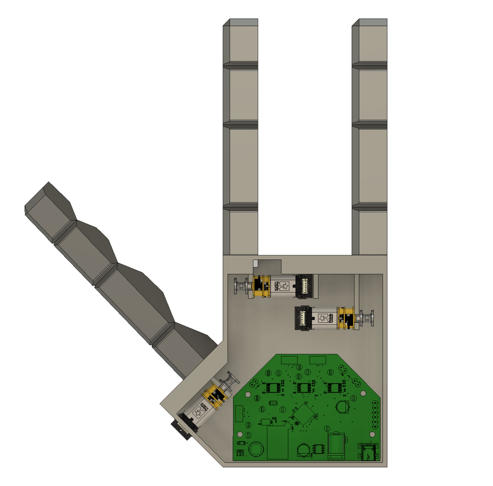
  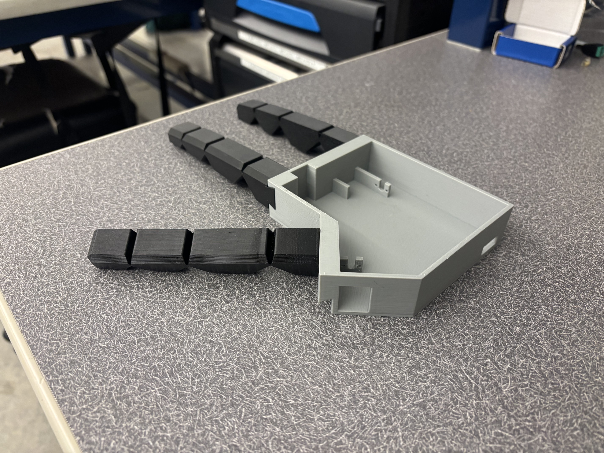
</p>

<p align="center">
  <b>Figure 1 – First Physical Prototype Produced</b>
</p>

The main issue was that our compliant fingers could only be bent in one direction. If the bending direction of the thumb and fingers were not mostly opposing, no grasping could be done. In addition to these shortcomings, the compliant fingers were too rigid, requiring a large amount of force to bend properly. This issue was addressed in the next design iteration by reducing the width of the compliant joint. However, several iterations were required to balance flexibility with printability, as excessively thin joints were prone to tearing during removal from the print bed.

<p align="center">
  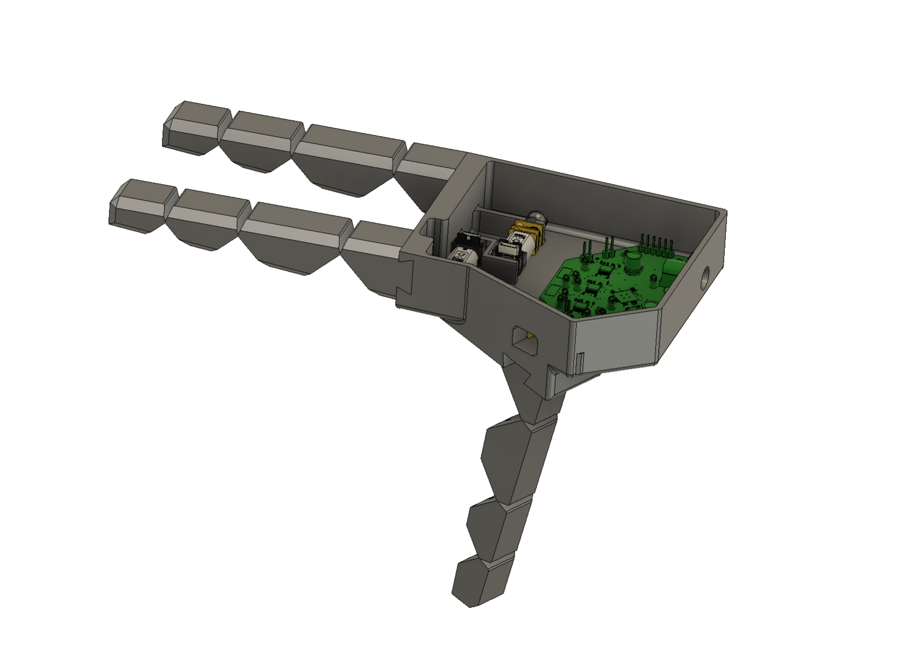
  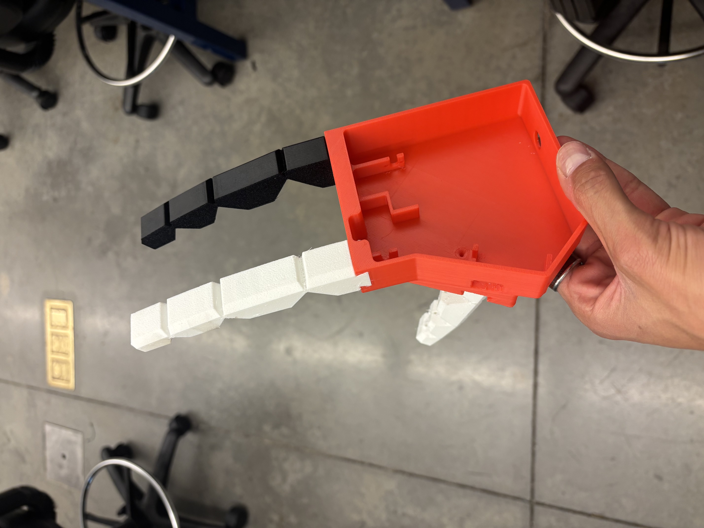
</p>

<p align="center">
  <b>Figure 2 – Second Prototype</b>
</p>

The second prototype shown in Figure 2 was a vast improvement on the first design. The thumb mechanism was secured to the bottom of the palm design which allowed it to bend towards the fingers, allowing for a much better grasping motion. Unfortunately, due to the unrefined angle and position of the thumb mount, contact with an object consisted solely between the left (pointer) finger and the thumb. Additionally, the compliant mechanism design needed improvement as they would be more inclined to bend near the tip first due to their geometry, causing a reduction in gripping surface area. We still needed something more reliable that could provide a more consistent and simpler grasping motion. 

It was due time for a complete redesign. Both the palm and finger designs were changed as part of our next and final prototype. Starting with the compliant mechanism ‘finger’ and ‘thumb’, a completely different approach was taken to increase grip surface area. Referencing Figure 3 below, you can see we did this by increasing the number of joints while reducing the angle between them. This new iteration took multiple prints to get right, as the first prints weren’t rigid enough to elastically return to the starting position. Even after these adjustments, hot glue had to be applied over the first “knuckle” joint to increase joint rigidity and maintain constant tension in the fishing line, preventing it from slipping off the pulley.

<p align="center">
  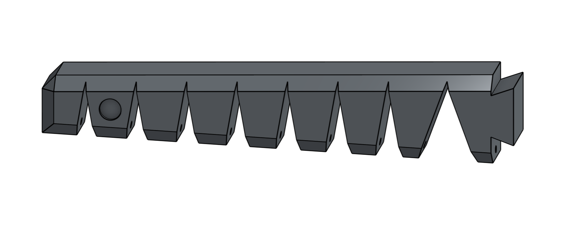
</p>

<p align="center">
  <b>Figure 3 – Compliant Mechanism Redesign</b>
</p>

Next for the structural ‘palm’ component, there were several design changes implemented. Some of the smaller updates included adding PCB mounting holes, tool-access openings, and revising the motor mounts, but the main refinement was once again the thumb geometry.  Much like the compliant mechanism redesign, all hope of utilizing biomimicry was thrown out the window and replaced with more advantageous geometry. The thumb mount was placed directly in line to both of the fingers so that their actuation paths were in parallel. This allowed the robotic hand to grip objects with a more balanced force distribution along both sides. The finger and thumb mounts were also slightly angled forward towards each other to create a smaller and ideally more accurate gripping area. These mechanical changes shown in Figure 4 below eventually contributed to producing the first, reliably gripping prototype capable of achieving our goals for this project. 

<p align="center">
  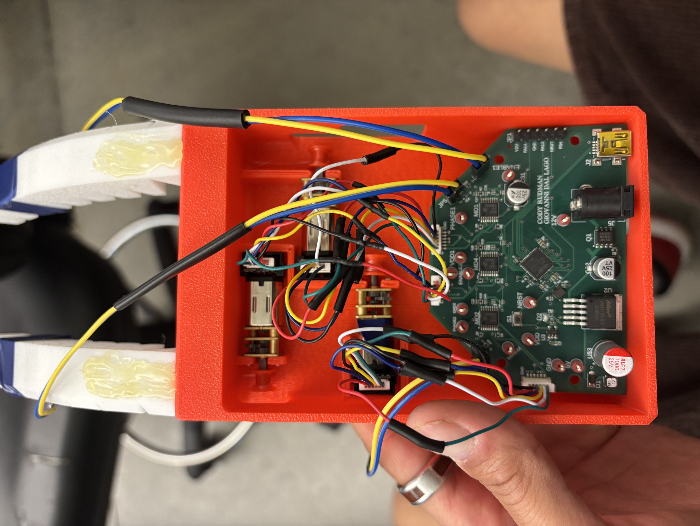
  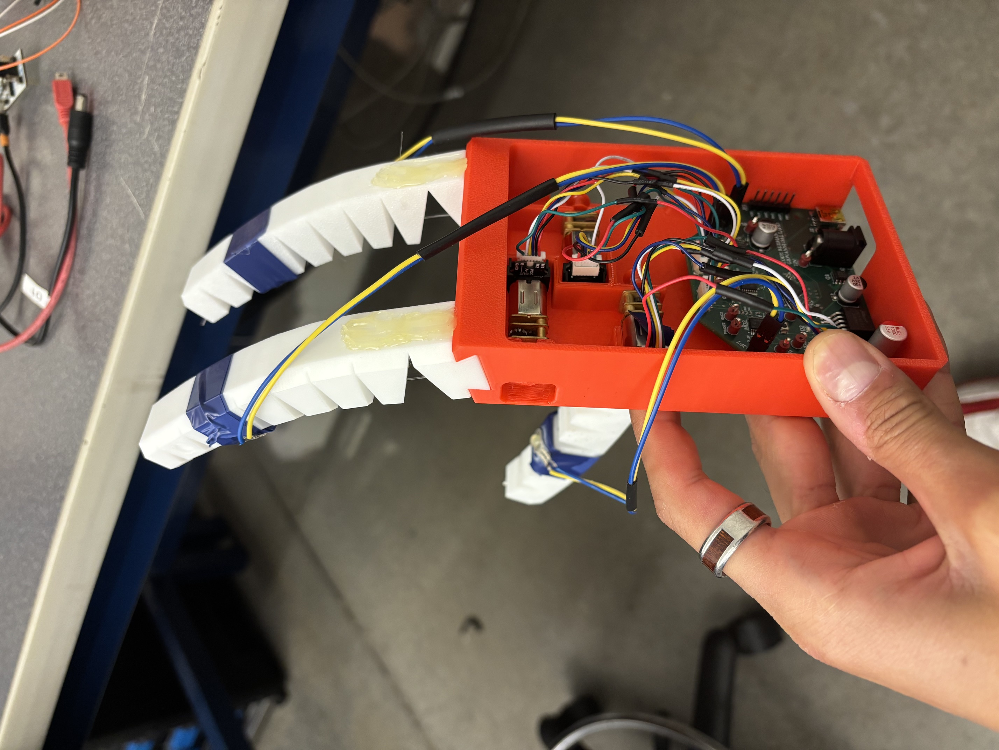
</p>

<p align="center">
  <b>Figure 4 – Final Robotic Hand CAD Design</b>
</p>

## Major Hardware

The controller target is an STM32F411CEUx configured from `Codebase/lab2.ioc`. The firmware uses TIM1 channels 1, 2, and 3 as PWM outputs for the three motor channels; TIM2, TIM3, and TIM4 as quadrature encoder interfaces; ADC1 channels 0, 1, and 2 as analog pressure sensor inputs; and USB full speed as a CDC serial device for user commands and telemetry.

The mechanical system is modeled in firmware as three independently actuated fingers. Each finger has a motor, a direction or phase output, an encoder, and one pressure sensor. This makes each finger an independent closed-loop axis while still allowing group behaviors such as a synchronized grab or an uneven-object grasp.

## Motors and Actuators

The hand uses three motor channels, one per finger. Motor speed is commanded by PWM duty cycle from TIM1, while direction is set by GPIO phase pins on PB0, PB1, and PB2. The firmware stores each motor channel in a `MotorRuntime` structure containing its PWM timer, encoder timer, phase pin, pressure sensor index, current state, duty cycle, and encoder-derived travel measurements.

The code ramps duty cycle rather than stepping immediately to full command. `Motor_RampDuty()` limits the change by `MOTOR_DUTY_RAMP_STEP_PERCENT` every `MOTOR_DUTY_RAMP_STEP_MS`, which reduces abrupt startup behavior and gives the pressure controller a more predictable actuator response.

## Challenges and Workarounds

Like the mechanical design, the electrical system also introduced several unexpected challenges that required workarounds throughout the later stages of the project. The first major issue we ran into was related to the JST-style motor connector adapter that connected the motors to our PCB. During the board design process, the connector footprint was unintentionally routed backward, effectively flipping the connector orientation 180 degrees. As a result, the motor driver outputs on the board did not correctly match the corresponding motor connector inputs. At first, we assumed that the only solution would be to desolder and re-solder the wire-to-board connector in the correct orientation. However, this would have been difficult and risky given the limited time remaining and the possibility of damaging the board. We eventually landed on the much simpler, although less elegant, solution of cutting the JST connector wires and re-soldering them into the correct order. This can be seen by referencing the final design in Figure 4. The wire colors were not consistent throughout the connector assembly, which made this process slightly more confusing than expected, but the workaround was successful and allowed the motors to function properly.

The next set of issues revolved around incorrect resistor values on the PCB. The resistor values originally selected for the force sensor circuit were too high, which limited the usefulness and sensitivity of the sensor readings. It would top out at >90% with around 30grams of force. 
Initially, we considered removing and replacing the small surface-mount resistors directly on the board, but this would have been tedious and difficult to do reliably. 
Instead, we realized that an additional 7.5k Ohm resistor could be soldered in parallel across the existing onboard resistor by using the vias on either side of it. This allowed us to reduce the effective resistance = 7K Ohm to a more useful value without fully removing the original components.
the Jump from 100k to 7k managed to allign the 90% with around 0.8kg of force, These additional resistors shown in Figure 5 were soldered to the bottom side of the PCB, which did create a new mechanical constraint. Because the added components extended below the board, spacers had to be added to the PCB mounting holes to prevent the resistors from contacting the bottom of the palm assembly.

<p align="center">
  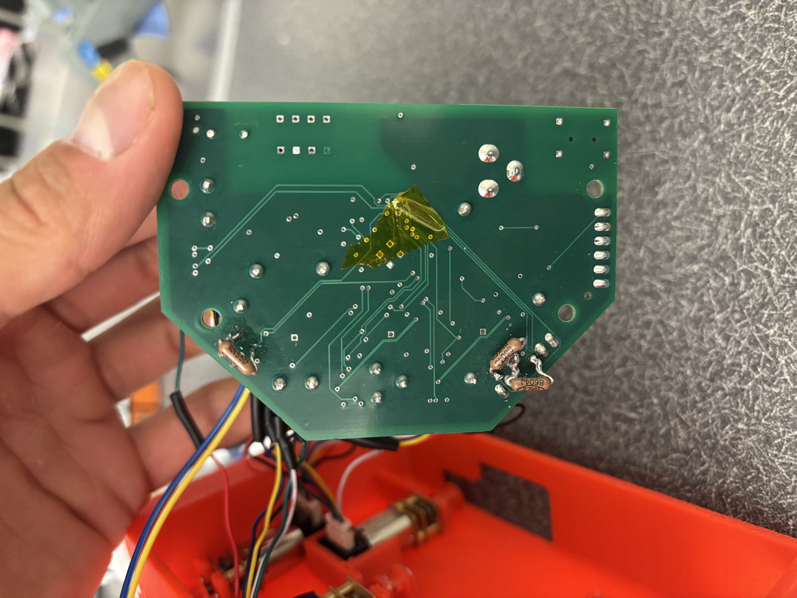
</p>

<p align="center">
  <b>Figure 5 – Soldered Parallel Resistors for Force Sensor Circuit</b>
</p>

Unfortunately, not all resistor-related issues were as easy to correct. Another problem came from the current limit resistor values used for the motor drivers. The selected resistance value was much too high (2 ohms instead of 0.2), which caused the motor current limit to be significantly lower than intended. This limited the available motor current to approximately 0.25 amps per motor, which reduced the output torque of the motors and ultimately limited the gripping force of the robotic hand. In theory, this issue could have been corrected by adding a carefully selected resistor in parallel with the existing current limit resistor. However, the required resistance value was much more specific than the parts we had available, and there was not enough time left in the project to source the correct component. Because of this, the current limit issue remained unresolved and became one of the main electrical limitations of the final prototype.

The final major electrical issue was related to the current sensing feature of the motor drivers. During testing, we were not receiving any usable current sensor values, even though the rest of the motor driver circuitry appeared to be functioning. After further inspection, we determined that the footprint used for the motor driver had two of the current sensing pins switched. This meant that the current sensing circuit was not connected correctly on the PCB itself. Unlike the connector wiring or force sensor resistor issue, this problem was not realistically solvable with the time and resources we had available. Correcting it would have most likely required a full revision of the PCB. While losing the current sensing functionality was disappointing, the rest of the feedback system was still usable. Thankfully, both the encoders and force sensors were functional, which allowed the final prototype to still demonstrate closed-loop sensing and basic gripping performance.


## Sensors

Each finger uses a pressure sensor read through ADC1. The firmware maps raw 12-bit ADC values to percent of full scale with `PressurePercentFromRaw()`, using `ADC_MAX_COUNTS = 4095`. Pressure readings are stored in both raw counts and percent so telemetry can show the unprocessed measurement and the control-friendly normalized value.

Each motor also has encoder feedback. Encoder counts are accumulated in signed software counters, which lets the firmware handle timer wraparound and convert travel into logical forward or release motion. The defined encoder scale is `ENCODER_COUNTS_PER_MOTOR_ROTATION = 4096`, with an output rotation limit of `FORWARD_OUTPUT_ROTATION_LIMIT = 0.8`.

## Custom PCB

The CubeMX project is configured for a custom PCB built around the STM32F411CEUx. The board brings the full hand controller onto one compact assembly: power regulation, three motor-driver channels, pressure-sensor inputs, encoder interfaces, USB, and the external connectors needed to reach each finger.

<p align="center">
  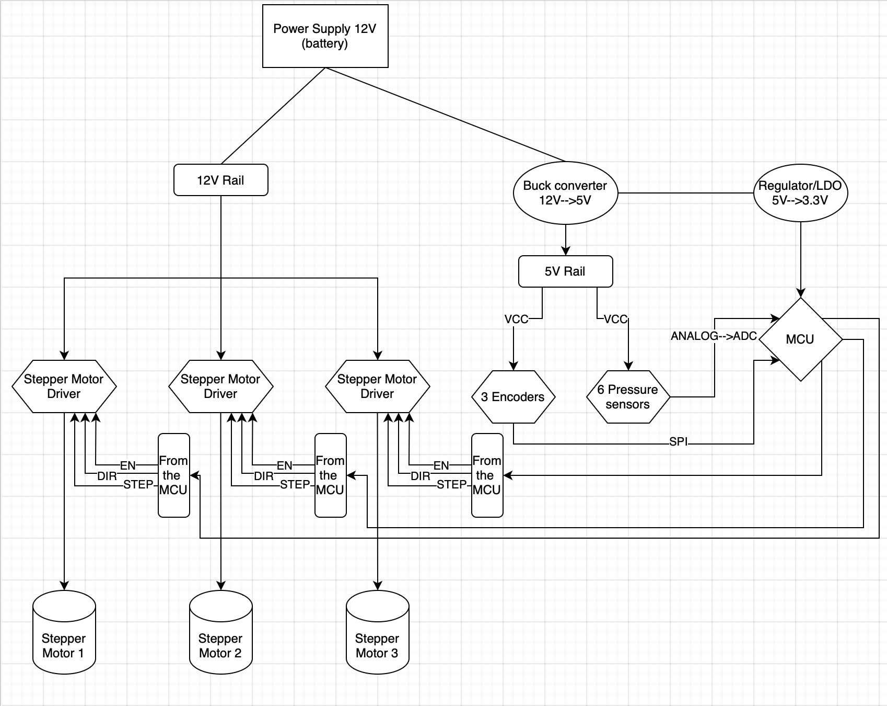
</p>

<p align="center">
  <b>Figure 6 - PCB-level electrical architecture</b>
</p>

Power enters from the 12 V battery rail. The 12 V rail feeds the three motor-driver sections directly, while a buck converter generates the 5 V rail for peripheral power. A local 3.3 V regulator then supplies the MCU logic domain. This separation keeps the high-current motor path away from the low-voltage controller and sensor rails, while still sharing a common ground reference.

The final PCB uses three motor-driver stages, one per finger motor. Each driver receives a dedicated MCU command path for PWM/enable and direction control, then drives its matching motor connector. The motor connectors are placed near the mechanical exit points for the fingers so the wiring can leave the PCB in the same physical direction as the tendons and motor assemblies. This reduces cable crossing and makes assembly easier because each motor, encoder, and force-sensor connection naturally maps to one finger.

The sensing side follows the same per-finger layout. Three force sensors are routed into ADC-capable MCU pins, giving one contact-force measurement per finger. The encoder connections are grouped as feedback inputs so the firmware can measure travel and release distance for each motor channel. The connection diagram was used as a net-level check to keep the motor, sensor, encoder, USB, reset, and power rails separated by function before routing the board.

<p align="center">
  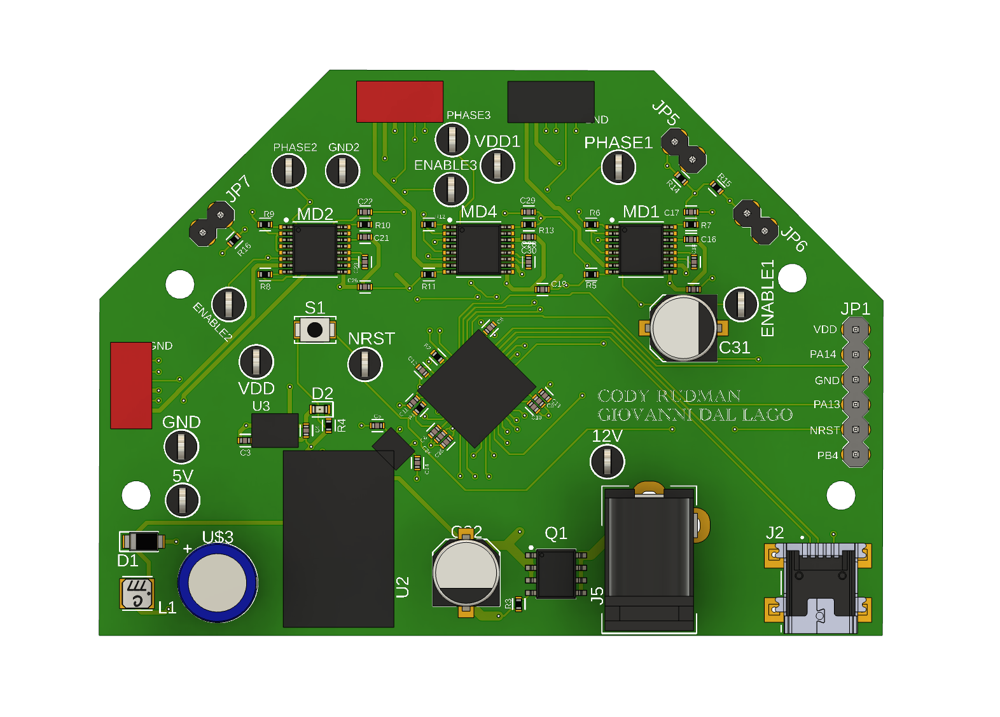
</p>

<p align="center">
  <b>Figure 7 - 3D render of the custom controller PCB</b>
</p>

<p align="center">
  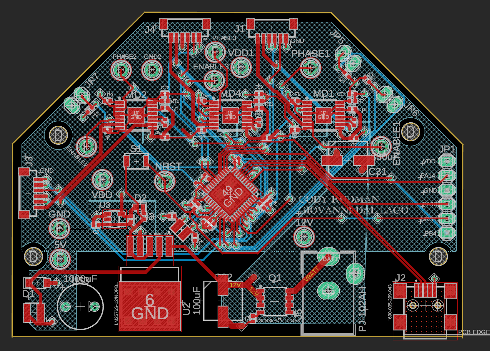
</p>

<p align="center">
  <b>Figure 8 - PCB routing and component placement</b>
</p>

The pin map reflected in firmware is:

| Function | Pins |
| --- | --- |
| Pressure sensors | PA0, PA1, PA2 |
| Motor PWM | PA8, PA9, PA10 |
| Motor phase or direction | PB0, PB1, PB2 |
| Encoders | TIM2 on PA15/PB3, TIM3 on PA6/PA7, TIM4 on PB6/PB7 |
| USB CDC | PA11, PA12 |

The PCB routing reflects these groups physically: motor-driver components are placed along the upper edge near the motor headers, the MCU sits near the center to shorten control traces, and the power-entry and regulation components sit near the lower edge where the battery and USB connectors are accessible. This placement keeps the board readable during debugging while keeping the high-current and low-level signal paths organized.

## Robot Design

The design uses a simple separation between the mechanical fingers and the controller behavior. Mechanically, each finger is treated as one motorized axis that can move forward to close or backward to release. Electrically, each axis exposes motor direction, motor PWM, encoder feedback, and contact pressure to the STM32.

That separation makes the firmware scalable: almost all behavior is implemented by iterating over the three `MotorRuntime` entries. The same state machine logic can stop one finger when it reaches pressure, release one finger based on its previous travel, or synchronize all fingers for an object-level behavior.

## Software Implementation

The firmware is written in C using STM32 HAL and generated CubeIDE support files. The application-specific code is concentrated in the user-code sections of `main.c` and `usbd_cdc_if.c`, which keeps the project compatible with CubeMX regeneration while preserving custom control logic.

The main loop calls `App_Update()` continuously. That update function polls USB commands, runs the 10 ms control loop, ramps motor duty cycle every 25 ms, and prints status telemetry every 100 ms. The control loop reads pressure sensors, updates encoders, evaluates the state of each motor, and then applies stopping, holding, release, setup, adjustment, or PID behavior.

## Firmware Capabilities and Code Excerpts

The firmware is organized around the actions the hand needs to perform during a demonstration: close around an object, release by the same measured travel, grip with different force levels, handle uneven objects, run a pressure feedback mode, manually jog a single finger, run a setup sequence, and stop immediately. These behaviors all use the same per-motor runtime model, so the three fingers can share one control structure while still keeping independent encoder counts, pressure readings, direction signs, and state.

```c
typedef enum
{
  MOTOR_STATE_IDLE = 0,
  MOTOR_STATE_GRABBING,
  MOTOR_STATE_HOLDING,
  MOTOR_STATE_RELEASING,
  MOTOR_STATE_ADJUSTING,
  MOTOR_STATE_GRABPID,
  MOTOR_STATE_LIGHT,
  MOTOR_STATE_HARD,
  MOTOR_STATE_UNEVEN,
  MOTOR_STATE_SETUP_FORWARD,
  MOTOR_STATE_SETUP_BACKWARD
} MotorState;
```

The state enum makes the control loop explicit. A motor is never just "on"; it is grabbing, holding, releasing, adjusting, running pressure control, or moving through the setup routine. The larger `MotorRuntime` structure stores the hardware handles and all motion bookkeeping for one finger:

```c
typedef struct
{
  TIM_HandleTypeDef *encoder_timer;
  TIM_HandleTypeDef *pwm_timer;
  uint32_t pwm_channel;
  GPIO_TypeDef *phase_port;
  uint16_t phase_pin;
  GPIO_PinState grab_phase;
  int32_t encoder_grab_sign;
  uint32_t pressure_index;

  int32_t encoder_position_counts;
  int32_t grab_start_counts;
  int32_t grab_travel_counts;
  int32_t release_start_counts;
  int32_t release_target_counts;
  int32_t adjust_start_counts;
  int32_t adjust_target_counts;
  int32_t grabpid_integral;
  int8_t grabpid_output_sign;
  uint32_t duty_percent;
  MotorState state;
} MotorRuntime;
```

Each finger therefore has its own encoder timer, PWM channel, phase pin, pressure-sensor index, and stored travel distance. This is what lets the firmware stop one finger because it reached pressure while another finger is still closing, and it is also what lets `release` move each finger back by the distance it actually traveled during the previous grasp.

The command layer is intentionally simple. USB CDC parsing sets command flags, and the main loop polls them in priority order. `STOP` and `release` return immediately after being handled, while other commands can start a new behavior:

```c
static void App_HandleSerialCommands(void)
{
  if (USB_CDC_PollStopCommand() != 0U)
  {
    App_StopAllMotors("STOP");
    return;
  }

  if (USB_CDC_PollReleaseCommand() != 0U)
  {
    App_StartRelease();
    return;
  }

  if (USB_CDC_PollGrabCommand() != 0U)    { App_StartGrab(); }
  if (USB_CDC_PollGrabPidCommand() != 0U) { App_StartGrabPid(); }
  if (USB_CDC_PollLightCommand() != 0U)   { App_StartLight(); }
  if (USB_CDC_PollHardCommand() != 0U)    { App_StartHard(); }
  if (USB_CDC_PollUnevenCommand() != 0U)  { App_StartUneven(); }
  if (USB_CDC_PollSetupCommand() != 0U)   { App_StartSetup(); }
}
```

The available user-level functions are:

| Command | Firmware behavior |
| --- | --- |
| `grab` | Close all fingers until each reaches its normal pressure threshold or travel limit. |
| `light` | Close with lower pressure thresholds for delicate objects. |
| `hard` | Close with higher pressure thresholds for firmer objects. |
| `uneven` | Close around irregular objects and stop the group once the primary finger plus one secondary finger have contact. |
| `grabpid` | Regulate each finger around a pressure target using proportional pressure feedback. |
| `release` | Open each finger by replaying the measured closing distance in reverse. |
| `adj <motor> <+|-> <rotations>` | Move one selected motor by a specified signed rotation amount. |
| `setup` | Run each finger forward and backward through the configured travel range. |
| `STOP` | Immediately stop every motor and clear active motion targets. |

The central update function separates sensing, control decisions, ramping, and telemetry into timed sections. Pressure and encoder updates run every 10 ms. Duty-cycle ramping runs every 25 ms so the motors do not jump abruptly to the target command.

```c
static void App_Update(void)
{
  uint32_t now = HAL_GetTick();

  App_HandleSerialCommands();

  if ((now - last_control_tick) >= CONTROL_UPDATE_MS)
  {
    App_ReadPressureSensors();

    for (uint32_t i = 0U; i < MOTOR_COUNT; i++)
    {
      Motor_UpdateEncoder(&motors[i]);

      if (motors[i].state == MOTOR_STATE_GRABBING)
      {
        App_UpdateGrabMotor(i);
      }
      else if (motors[i].state == MOTOR_STATE_GRABPID)
      {
        App_UpdateGrabPidMotor(i);
      }
      else if (motors[i].state == MOTOR_STATE_RELEASING)
      {
        if (Motor_GetLogicalReleaseTravelCounts(&motors[i]) >=
            motors[i].grab_travel_counts)
        {
          Motor_Stop(&motors[i]);
          motors[i].state = MOTOR_STATE_IDLE;
        }
      }
    }

    App_UpdateUnevenGrab();
  }
}
```

The normal grab behavior combines two stopping conditions: encoder travel and pressure. This protects the mechanism if the finger never contacts an object, while still allowing pressure to stop motion early when contact is detected.

```c
static void App_UpdateGrabMotor(uint32_t motor_index)
{
  MotorRuntime *motor = &motors[motor_index];
  int32_t forward_counts = Motor_GetLogicalForwardCounts(motor);
  int32_t command_travel_counts =
      forward_counts - (motor->grab_start_counts * motor->encoder_grab_sign);
  uint32_t finger_pressure_percent =
      pressure_percent[grab_pressure_index[motor_index]];

  if (command_travel_counts < 0L)
  {
    command_travel_counts = 0L;
  }
  motor->grab_travel_counts = command_travel_counts;

  if ((command_travel_counts >= FORWARD_TRAVEL_LIMIT_COUNTS) ||
      (finger_pressure_percent >= grab_stop_percent[motor_index]))
  {
    App_StopMotorHolding(motor);
  }
}
```

`release` uses the stored `grab_travel_counts` from the last grasp. This makes opening adaptive: if one finger stopped early because it touched the object first, it only backs out by that shorter distance.

```c
static void App_StartRelease(void)
{
  for (uint32_t i = 0U; i < MOTOR_COUNT; i++)
  {
    Motor_UpdateEncoder(&motors[i]);

    if (motors[i].grab_travel_counts > 0L)
    {
      motors[i].release_start_counts = motors[i].encoder_position_counts;
      motors[i].release_target_counts = motors[i].grab_travel_counts;
      motors[i].state = MOTOR_STATE_RELEASING;
      Motor_SetDirection(&motors[i],
          (motors[i].grab_phase == GPIO_PIN_SET) ? GPIO_PIN_RESET : GPIO_PIN_SET);
    }
    else
    {
      motors[i].state = MOTOR_STATE_IDLE;
      Motor_Stop(&motors[i]);
    }
  }
}
```

The uneven-object mode was added because the fingers do not always contact an irregular object at the same time. Instead of requiring all three pressure sensors to cross threshold, it waits for the configured primary finger and at least one secondary finger. Once that condition is met, all active fingers are stopped and held.

```c
if ((threshold_reached[uneven_primary_finger_index] != 0U) &&
    ((threshold_reached[uneven_secondary_finger_a_index] != 0U) ||
     (threshold_reached[uneven_secondary_finger_b_index] != 0U)))
{
  stop_all = 1U;
}

if (stop_all != 0U)
{
  for (uint32_t i = 0U; i < MOTOR_COUNT; i++)
  {
    App_StopMotorHolding(&motors[i]);
  }
}
```

The `grabpid` mode is a pressure feedback behavior. The firmware computes pressure error for each finger, applies the configured PID terms, limits the output duty cycle, and reverses direction when the pressure is above target. Integral and derivative fields are already present, even though the current tuning uses proportional gain only.

```c
error = (int32_t)grabpid_target_percent[motor_index] -
        (int32_t)pressure_percent[motor->pressure_index];

motor->grabpid_integral += error;
derivative = error - motor->grabpid_previous_error;
motor->grabpid_previous_error = error;

output = ((grabpid_kp[motor_index] * error) +
          (grabpid_ki[motor_index] * motor->grabpid_integral) +
          (grabpid_kd[motor_index] * derivative)) / GRABPID_GAIN_SCALE;

output_sign = (output > 0L) ? 1 : -1;
duty_percent = (uint32_t)Abs32(output);
if (duty_percent > grabpid_max_duty_percent[motor_index])
{
  duty_percent = grabpid_max_duty_percent[motor_index];
}
```

Manual adjustment and setup use the same count-based motion logic. `adj` converts a requested rotation into encoder counts and moves one selected finger. `setup` runs each finger forward and backward through the full travel limit so the mechanism can be checked in sequence.

```c
motor->adjust_start_counts = motor->encoder_position_counts;
motor->adjust_target_counts = adjust_counts;
motor->adjust_direction_sign = direction_sign;
motor->state = MOTOR_STATE_ADJUSTING;

Motor_SetDirection(motor,
                   (direction_sign > 0) ?
                   motor->grab_phase :
                   ((motor->grab_phase == GPIO_PIN_SET) ?
                    GPIO_PIN_RESET : GPIO_PIN_SET));
```

The low-level helpers keep the behavior repeatable. Encoder wraparound is handled before accumulating signed position, and all motor directions are converted into logical forward/release travel using `encoder_grab_sign`.

```c
static void Motor_UpdateEncoder(MotorRuntime *motor)
{
  uint32_t raw = __HAL_TIM_GET_COUNTER(motor->encoder_timer) & motor->encoder_mask;
  int32_t delta;

  if (motor->encoder_mask == 0x0000FFFFUL)
  {
    delta = (int32_t)(int16_t)((uint16_t)(raw - motor->encoder_last_raw));
  }
  else
  {
    delta = (int32_t)(raw - motor->encoder_last_raw);
  }

  motor->encoder_raw = raw;
  motor->encoder_last_raw = raw;
  motor->encoder_position_counts += delta;
}
```

Pressure readings are sampled one ADC channel at a time and normalized to percent of the 12-bit ADC range. Reporting both raw and percent values makes debugging easier because the raw value shows the actual sensor measurement while the percent value is easier to compare against thresholds.

```c
static uint32_t PressurePercentFromRaw(uint32_t raw)
{
  if (raw > ADC_MAX_COUNTS)
  {
    raw = ADC_MAX_COUNTS;
  }

  return (raw * 100U) / ADC_MAX_COUNTS;
}
```

The PWM ramp function prevents abrupt motor starts and stops. Instead of instantly jumping to a new duty cycle, each motor moves toward its target duty in fixed steps every ramp interval.

```c
static void Motor_RampDuty(MotorRuntime *motor, uint32_t target_duty_percent)
{
  uint32_t next_duty = motor->duty_percent;

  if (next_duty < target_duty_percent)
  {
    next_duty += MOTOR_DUTY_RAMP_STEP_PERCENT;
  }
  else if (next_duty > target_duty_percent)
  {
    if (next_duty > MOTOR_DUTY_RAMP_STEP_PERCENT)
    {
      next_duty -= MOTOR_DUTY_RAMP_STEP_PERCENT;
    }
    else
    {
      next_duty = 0U;
    }
  }

  Motor_SetDutyPercent(motor, next_duty);
}
```

## Drivers and Interfaces

The USB CDC command parser is one of the cleaner driver-level pieces. `CDC_Receive_FS()` parses incoming bytes into complete line commands, accepts backspace, handles command buffer overflow by resetting the buffer, and queues commands through volatile flags. The main loop later polls those flags with interrupt protection, so the USB receive path remains short and avoids running motor-control logic from the USB callback.

The parser accepts fixed commands such as `grab`, `hard`, and `STOP`, and also parses a parameterized adjustment command of the form `adj <motor> <+|-> <rotations>`. Rotation values can include fractional turns, which are stored internally as micro-rotations before conversion to encoder counts.

## Main Loop and Intelligence

The intelligence is implemented as a per-motor finite state machine. The `MotorState` enum includes idle, grabbing, holding, releasing, adjusting, PID grabbing, light grasp, hard grasp, uneven grasp, and setup motion states. Each motor can therefore stop independently when it reaches its own pressure target or travel limit, while commands such as `STOP` and `release` operate across all motors.

The grasp modes are threshold and feedback based. `grab`, `light`, and `hard` close the fingers until either pressure or travel limit is reached. `uneven` is designed for irregular objects: it waits until the primary finger and at least one secondary finger have contact before stopping the group. `grabpid` computes pressure error for each finger and commands a duty cycle proportional to that error, allowing the motor to move forward or backward to regulate contact force.

## Coding Style

The code uses procedural C with explicit state machines and small helper functions. Runtime state is stored in structs rather than global variables per channel, which keeps the three motor channels uniform and reduces duplicated control code. The naming convention separates application functions with `App_`, motor helpers with `Motor_`, serial helpers with `Serial_`, and USB CDC command helpers with `USB_CDC_` or `CDC_`.

The code also uses fixed-width integer types and integer scaling for embedded reliability. For example, fractional rotations are parsed as micro-rotations, pressure is represented as percent, PID gains are scaled by `GRABPID_GAIN_SCALE`, and rotation telemetry is reported in milli-rotations to avoid floating-point formatting in the runtime path.

## Modeling and Calculations

The main physical model is the conversion between encoder counts and finger travel. With `ENCODER_COUNTS_PER_MOTOR_ROTATION = 4096` and `FORWARD_OUTPUT_ROTATION_LIMIT = 0.8`, the firmware computes a forward travel limit in encoder counts. During a grab, the code records the starting encoder count and stops the motor when logical forward travel exceeds that limit or the pressure threshold is reached.

Release motion uses the measured closing travel. When `release` is commanded, each finger moves in the opposite direction until its release travel matches the previously recorded grab travel. This makes release behavior adaptive to the actual object rather than relying on a fixed release duration.

Pressure control is implemented by normalizing ADC counts to percent and comparing that value against per-finger thresholds or PID targets. The PID mode currently uses proportional gain with integral and derivative gains configured to zero, but the data structure includes integral accumulation, derivative calculation, output limiting, deadband handling, and direction reversal.

## Dynamic Behavior

Dynamic behaviors are calculated from encoder deltas, pressure thresholds, and duty ramps. A motor is not simply run for a fixed time. Instead, the firmware measures how far it has moved, how much pressure it is applying, and which state it is in. The duty target is then ramped toward the mode-specific command, such as normal grasp duty, setup duty, or PID-selected duty.

The setup mode demonstrates sequenced behavior. It moves each finger forward and backward through the configured travel range, then advances to the next finger. During backward setup travel, the code can start the next finger early when the current finger is close enough to completing its return travel. This overlap reduces idle time during the setup sequence.

## Performance, Challenges, and Workarounds

The project is structured around reliability concerns that usually appear in small robotic hands: avoiding overtravel, preventing excessive grip pressure, keeping serial command handling responsive, and preserving enough telemetry to diagnose failures. The firmware addresses these by combining encoder travel limits, pressure thresholds, immediate `STOP`, periodic CSV telemetry, and command-specific state transitions.

A key challenge is that pressure sensors and mechanical fingers rarely behave identically. The code therefore uses per-finger pressure thresholds, per-finger PID targets, and per-motor direction signs. Another challenge is recovering from partial grasps or irregular objects, which is why the firmware records per-finger travel before release and includes a separate `uneven` behavior.

## Testing and Demonstration

The firmware reports a startup banner, supported command list, and telemetry header over USB CDC. During operation it prints time, motor states, encoder readings, rotation estimates, duty cycles, raw pressure readings, and normalized pressure readings. These logs can be captured during a demonstration to show repeatability and to diagnose root causes when behavior is inconsistent.

The repository now includes mechanical CAD images and PCB design images. A demonstration video, completed-board photos, and any rework photos should still be added under `docs/media/` before final submission if they are available, then linked from this section.

## Media and Attachments

Recommended final attachments:

- Demonstration video showing `grab`, `release`, and at least one object-specific mode such as `light`, `hard`, `uneven`, or `grabpid`.
- Photo of the assembled hand.
- Photo of the custom PCB.
- CAD render or image of the finger and hand assembly.
- PCB block diagram, 3D render, and routing layout.
- Any rework photos, especially if they explain a reliability problem and its fix.

See `docs/media/README.md` for the media asset list.
